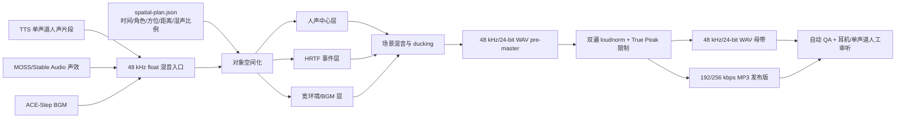

# 空间音频落地方案

## 1. 结论先行

当前机器和仓库已经具备落地双耳空间音频的基础能力，不需要新增 GPU 模型，也不需要把
空间化逻辑塞进 TTS worker。推荐把空间化作为 **TTS 合成完成后的独立 CPU 后期阶段**：

1. TTS 人声、MOSS/Stable Audio 声效、ACE-Step BGM 保留为独立素材；
2. 全部素材只在进入混音时统一为 48 kHz，内部使用 float 处理；
3. 旁白保持中心清晰，只加入少量去相关和早期反射；
4. 脚步、耳语、敲门、风雨等事件声使用 HRTF 定位，并按场景移动；
5. BGM 和环境声做宽，人声不做全程绕头；
6. 输出 48 kHz/24-bit 双声道 WAV 母带，再做响度归一化并编码为
   192～256 kbps MP3；
7. 最终 MP3 重新检测响度、True Peak、相位和单声道折叠，不能只检测 WAV 母带。

只对已经合并完成的 `fireRedTTS3.wav` 使用“一键扩宽”，可以明显改善耳机声场，但无法
真正复刻参考 MP3。参考音频和源音频不是同一节目，时长、内容、背景声和母带处理都不同；
可比较的是声场特征，不能把二者当作严格 A/B 样本。

本方案分两步交付：

- **立即可跑的 P0**：对现有长 WAV 做保守的中心人声 + Haas 湿声 + 早期反射，约几秒钟
  完成 7 分钟音频的 CPU 后处理；
- **正式生产的 P1**：从合并前的 TTS 片段开始，按场景加入 HRTF 声效、环境声和 BGM。
  这是达到参考样本“声源在头外、左右持续变化、局部绕头”体验的正确路径。

## 2. 当前样本与机器的实测依据

### 2.1 两个样本不是同一内容

| 指标 | `fireRedTTS3.wav` | `有史以来最好空间声.mp3` |
|---|---:|---:|
| 时长 | 443.05 秒 | 572.76 秒 |
| 编码 | PCM 16-bit WAV | MP3 192 kbps |
| 采样率 | 44.1 kHz | 48 kHz |
| 声道 | 双声道 | 双声道 |
| 综合响度 | −16.81 LUFS | −10.91 LUFS |
| True Peak | +0.01 dBTP | +3.18 dBTP |
| LRA | 9.20 LU | 14.50 LU |
| Mid 平均电平 | −20.8 dB | −14.8 dB |
| Side 平均电平 | −36.5 dB | −20.6 dB |
| 活跃 1 秒块相关系数中位数 | 1.000 | 0.543 |
| 活跃块中接近单声道的占比 | 81.2% | 1.1% |
| Side/Mid 中位数 | −219.8 dB | −5.1 dB |
| 负相关活跃块占比 | 0% | 11.5% |

测量表明：源 WAV 虽然在文件头中是双声道，但绝大部分时间左右声道相同，听感接近单声道；
参考 MP3 几乎一直存在明显左右差异，局部 Side 能量接近甚至超过 Mid。这才是参考样本耳机
空间感明显的主要客观特征。

参考 MP3 的 +3.18 dBTP 不应作为母带目标。它说明解码后的重建峰值超过 0 dBFS，可能在
部分设备或后续转码时失真。方案借鉴它的声场宽度和动态变化，不复制其过响电平。

### 2.2 当前机器足够，空间化不需要占用共享 GPU

实测环境：

| 项目 | 当前值 | 结论 |
|---|---|---|
| CPU | Intel i5-13600KF，20 线程 | 足够实时以上速度完成 FFmpeg 卷积和混音 |
| 内存 | 35 GiB 可见，约 30 GiB 可用 | 长音频流式处理无压力，不应整段读入内存 |
| GPU | RTX 4070 Ti SUPER，16 GiB | 留给 TTS、声效和 BGM worker；后处理不需要 CUDA |
| FFmpeg | 6.1.1 | 已具备所需滤镜 |
| 关键编译能力 | `libmp3lame`、`libsoxr`、`libmysofa` | 可做 MP3、优质重采样和 SOFA/HRTF |
| 本地 HRTF | `/usr/share/libmysofa/MIT_KEMAR_normal_pinna.sofa` | 可用于本机 POC |

当前 FFmpeg 已验证存在 `sofalizer`、`headphone`、`haas`、`afir`、`loudnorm`、
`ebur128`、`alimiter`、`stereotools` 等滤镜。空间化阶段应作为普通 CPU 子进程运行，
不获取项目的 `GPU_LOCK_FILE`，避免无意义地阻塞模型服务。

## 3. 为什么不能靠一个滤镜完全复刻参考音频

空间感至少由以下五层共同形成：

| 层 | 作用 | 仅有最终长 WAV 时能否恢复 |
|---|---|---|
| 表演层 | 耳语、呼吸、距离感、情绪 | 只能保留已有表演，不能凭后期补出真实耳语 |
| 声源层 | 人声、脚步、门、雨、风等独立对象 | 不能无损拆回独立 stem |
| 位置层 | 方位、距离、移动轨迹、HRTF | 可全局模拟，但不能准确按对象定位 |
| 环境层 | 早期反射、房间尾响、背景 ambience | 可新增，但必须按场景设计 |
| 母带层 | 响度、动态、峰值、编码 | 可以完整重做 |

因此，正式生产必须在 TTS 片段合并之前保留 stem 和时间线。`fireRedTTS3.wav` 的 P0 方案
是一个有用的试听版本，不是生产上限。

## 4. 推荐生产架构



### 4.1 各素材的默认处理策略

| 素材 | 默认位置 | 空间化强度 | 说明 |
|---|---|---:|---|
| 主旁白 | 正前方 0° | 低 | 清晰度优先，避免全程左右晃动造成疲劳 |
| 角色对白 | ±15°～45° | 中 | 同一场景中角色位置应稳定 |
| 近耳耳语 | ±70°～100° | 高、短时 | 控制低频和齿音，保留中心少量干声 |
| 后方脚步/敲门 | 150°～210° | 高 | 配合低通、音量和混响表示距离 |
| 移动声效 | 起止角度按剧情 | 高、自动化 | 用多个 HRTF 关键点交叉淡化，不做突变 |
| 房间环境声 | 全宽 | 中 | 低于人声，不占据中心 |
| BGM | 宽立体声 | 中 | 人声出现时自动 ducking 3～8 dB |

### 4.2 `spatial-plan.json` 最小字段建议

现有流程图已经把 `spatial-plan.json` 放在空间化入口。建议每个事件至少记录：

```json
{
  "mix_sample_rate": 48000,
  "loudness_target_lufs": -18.0,
  "true_peak_target_dbtp": -2.0,
  "events": [
    {
      "id": "door-knock-001",
      "source": "storage/soundEffect/door-knock.wav",
      "start_ms": 82350,
      "end_ms": 85350,
      "azimuth_start": 180,
      "azimuth_end": 225,
      "elevation": 0,
      "distance_m": 2.5,
      "gain_db": -12.0,
      "wet": 0.85,
      "room": "wooden-room-small"
    }
  ]
}
```

角度约定应固定为：0° 正前、90° 左、180° 后、270° 右。`distance_m` 不能只映射到
音量，还应联动高频衰减、直达声/混响比和早期反射。

## 5. P0：立即处理现有 `fireRedTTS3.wav`

### 5.1 预检

从仓库根目录执行：

```bash
MIX_INPUT='special-audio-effect/fireRedTTS3.wav'
MIX_OUTPUT_DIR='special-audio-effect/output'
SOFA_FILE='/usr/share/libmysofa/MIT_KEMAR_normal_pinna.sofa'

test -r "$MIX_INPUT"
command -v ffmpeg
command -v ffprobe
ffmpeg -hide_banner -filters | rg 'sofalizer|haas|loudnorm|alimiter'
test -r "$SOFA_FILE"
mkdir -p "$MIX_OUTPUT_DIR"
```

### 5.2 先做 60 秒试听，不要一开始处理全书

以下链路保留源音频作为中心 dry，并创建三层：

- `dry`：中心干声，保证对白清晰和单声道兼容；
- `wide`：过滤后的 Haas 声只提取 Side，提供明确的左右时间/相位差；
- `room`：由 Mid 派生非对称早期反射，再只提取 Side，提供头外感。

```bash
ffmpeg -hide_banner -y \
  -ss 60 -t 60 \
  -i "$MIX_INPUT" \
  -filter_complex "
    [0:a]
      aresample=48000:resampler=soxr:precision=28,
      aformat=sample_fmts=fltp:sample_rates=48000:channel_layouts=stereo,
      asplit=3[dry_in][wide_in][room_in];
    [dry_in]
      volume=0.82[dry];
    [wide_in]
      highpass=f=180,
      lowpass=f=8000,
      haas=left_delay=4:right_delay=8:side_gain=1.20,
      pan=stereo|c0=0.5*c0-0.5*c1|c1=0.5*c1-0.5*c0,
      volume=0.38[wide];
    [room_in]
      pan=mono|c0=0.5*c0+0.5*c1,
      aecho=0.8:0.70:'19|37|61':'0.24|0.14|0.08',
      pan=stereo|c0=c0|c1=c0,
      adelay='0|13',
      lowpass=f=6500,
      pan=stereo|c0=0.5*c0-0.5*c1|c1=0.5*c1-0.5*c0,
      volume=0.16[room];
    [dry][wide][room]
      amix=inputs=3:normalize=0,
      highpass=f=70,
      alimiter=limit=0.891:attack=5:release=50:level=0:latency=1[out]
  " \
  -map '[out]' \
  -ar 48000 \
  -c:a pcm_s24le \
  "$MIX_OUTPUT_DIR/fireRedTTS3-spatial-preview.wav"
```

旧参数中的 `room` 支路因 `aecho out_gain=0.25` 后又乘 `volume=0.08`，平均电平比 dry
低约 34 dB，实际上几乎不可闻；Haas 的 `2.05/2.12 ms` 两侧差值也只有 0.07 ms。
新默认值把两条湿声改成 Side-only，避免它们同时抬高中间声道。对 FireRedTTS 同一 60 秒
片段跑完整 loudnorm 后，`balanced` 的相关性约为 0.730、Side/Mid 约为 −7.78 dB；
`immersive` 约为 0.384 和 −3.43 dB，均保持正相关。

日常长时间内容先选 `balanced`；仍觉得太窄时直接选择已经验收过的 `immersive`，不要在
生产环境临时把单个增益继续推高。齿音扩散或人声发虚时应回到 `balanced`；审听必须使用
立体声耳机或双扬声器，单声道设备会按设计抵消 Side 湿声。

### 5.3 渲染完整 pre-master

试听确认后，移除 `-ss 60 -t 60`，其余参数不变，输出：

```text
special-audio-effect/output/fireRedTTS3-spatial-pre-master.wav
```

不要覆盖 `fireRedTTS3.wav`。WAV pre-master 是可返工母版，MP3 只在最后生成一次。

## 6. P1：按场景加入真正的 HRTF 对象

### 6.1 使用仓库现有服务生成独立素材

事件型短声效优先使用 MOSS-SoundEffect：

```bash
curl -fsS -X POST http://127.0.0.1:8312/v1/moss/soundEffect \
  -H 'Content-Type: application/json' \
  -d '{"prompt":"雨夜中木门被轻敲三下，近距离，无可辨认说话声","seconds":3,"seed":42}' \
  -o "$MIX_OUTPUT_DIR/door-knock-mono.wav"
```

较长 ambience/texture 可使用 Stable Audio 3 Medium；纯 BGM 使用 ACE-Step：

```bash
curl -fsS -X POST http://127.0.0.1:8311/v1/stableAudio/soundEffect \
  -H 'Content-Type: application/json' \
  -d '{"prompt":"Rain outside an old wooden house at night, distant wind, seamless ambience, no speech. TrackType: SFX","seconds":30,"seed":42}' \
  -o "$MIX_OUTPUT_DIR/rain-ambience.wav"

curl -fsS -X POST http://127.0.0.1:8313/v1/aceStep/bgm \
  -H 'Content-Type: application/json' \
  -d '{"prompt":"Dark cinematic ambient underscore, sparse felt piano, low cello drone, restrained dynamics, designed underneath spoken narration, no vocals","seconds":60,"steps":8,"bpm":58,"keyscale":"D minor","timesignature":"4","seed":42}' \
  -o "$MIX_OUTPUT_DIR/underscore.wav"
```

生成模型负责“声音是什么”，后期时间线负责“声音在哪里”。不要在声效 prompt 中只写
“从左后方移动到右耳边”并期待模型稳定输出正确双耳轨迹。

### 6.2 把单声道事件放到指定方位

下面把敲门声放到听者后方。为让 `sofalizer` 正确识别一个活动虚拟扬声器，先创建
双声道布局，但只给 `FL` 虚拟通道送入信号；`FR` 保持静音。

```bash
ffmpeg -hide_banner -y \
  -i "$MIX_OUTPUT_DIR/door-knock-mono.wav" \
  -af "
    pan=mono|c0=0.5*c0+0.5*c1,
    aresample=48000:resampler=soxr:precision=28,
    pan=stereo|c0=c0|c1=0*c0,
    sofalizer=
      sofa=$SOFA_FILE:
      type=freq:
      speakers='FL 180 0|FR 315 0':
      gain=10,
    alimiter=limit=0.891:level=0:latency=1
  " \
  -ar 48000 \
  -c:a pcm_s24le \
  "$MIX_OUTPUT_DIR/door-knock-behind.wav"
```

常用角度：

| 听感位置 | `FL` 方位角 |
|---|---:|
| 正前方 | `0` |
| 左前 | `45` |
| 左侧 | `90` |
| 正后方 | `180` |
| 右侧 | `270` |
| 右前 | `315` |

`gain=10` 是当前 KEMAR 文件的实用起点，不是全局固定标准。最终响度由场景增益和母带阶段
控制；若该事件触发 limiter，先降低 `gain`，不要依赖 limiter 长时间压扁素材。

### 6.3 移动声源

FFmpeg 6.1.1 的 `sofalizer` 方位参数不是 timeline 参数，不能在单个滤镜实例内连续自动化。
落地方式是：

1. 把事件素材按 100～300 ms 一个关键区间切片；
2. 分别按 180°、225°、270° 等角度渲染；
3. 相邻区间使用 50～150 ms `acrossfade`；
4. 再按 `start_ms` 用 `adelay` 放回主时间线。

不要用硬切换角度，否则会产生点击声和明显的方位跳变。对于脚步这类离散事件，可以让每一步
使用一个固定角度，按步点逐渐改变角度，效果通常比连续扫动更自然。

### 6.4 把事件放入长音频时间线

示例把空间化敲门声放到 82.350 秒：

```bash
ffmpeg -hide_banner -y \
  -i "$MIX_OUTPUT_DIR/fireRedTTS3-spatial-pre-master.wav" \
  -i "$MIX_OUTPUT_DIR/door-knock-behind.wav" \
  -filter_complex "
    [1:a]volume=0.50,adelay='82350|82350'[event];
    [0:a][event]amix=inputs=2:duration=first:dropout_transition=0,
      alimiter=limit=0.891:level=0:latency=1[mix]
  " \
  -map '[mix]' \
  -ar 48000 \
  -c:a pcm_s24le \
  "$MIX_OUTPUT_DIR/fireRedTTS3-scene-mix.wav"
```

正式实现应从 `spatial-plan.json` 生成 `filter_complex_script`，而不是把几百个事件拼成一条
shell 命令。每次处理仍只启动一个 FFmpeg 子进程，并采用临时文件加 `os.replace` 原子提交，
沿用仓库已有的存储约束。

## 7. 响度归一化与发布编码

### 7.1 建议目标

以下是本项目的工程起点，不是所有平台的强制规范：

| 指标 | 长篇有声书建议 | 说明 |
|---|---:|---|
| Integrated Loudness | −18 LUFS，容差 ±1 LU | 适合非线性在线语音内容的稳妥起点 |
| True Peak | ≤ −2 dBTP | 给 MP3/AAC 重建峰值留余量 |
| LRA | 5～10 LU | 悬疑场景可更宽，但不能影响对白可懂度 |
| WAV 母带 | 48 kHz/24-bit/stereo | 返工和归档 |
| MP3 发布版 | 48 kHz/192 kbps/stereo | 与参考样本格式一致 |
| 复杂 BGM/声效版本 | 48 kHz/256 kbps/stereo | 降低有损编码伪影 |

EBU 的流媒体建议允许由发行方把节目适配到例如 −18 LUFS；FFmpeg `loudnorm` 实现 EBU R128
并支持 Integrated Loudness、LRA 和最大 True Peak 目标。上架前仍应以具体平台当期规范为准。

### 7.2 双遍 `loudnorm`

第一遍只测量，不输出文件：

```bash
ffmpeg -hide_banner -nostats \
  -i "$MIX_OUTPUT_DIR/fireRedTTS3-scene-mix.wav" \
  -af loudnorm=I=-18:TP=-2:LRA=7:print_format=json \
  -f null - 2> "$MIX_OUTPUT_DIR/loudnorm-pass1.log"

tail -n 15 "$MIX_OUTPUT_DIR/loudnorm-pass1.log"
```

当前机器没有预装 `jq`。下面用 Python 标准库从 FFmpeg 日志中取出 JSON 数值，不引入项目依赖：

```bash
mapfile -t LOUDNORM_VALUES < <(
  python3 - "$MIX_OUTPUT_DIR/loudnorm-pass1.log" <<'PY'
import json
import re
import sys
from pathlib import Path

report = Path(sys.argv[1]).read_text(encoding="utf-8")
matches = re.findall(r"\{.*?\}", report, flags=re.DOTALL)
if not matches:
    raise SystemExit("loudnorm 日志中没有找到 JSON 测量结果")
measurement = json.loads(matches[-1])
for key in ("input_i", "input_tp", "input_lra", "input_thresh", "target_offset"):
    print(measurement[key])
PY
)

MEASURED_I="${LOUDNORM_VALUES[0]}"
MEASURED_TP="${LOUDNORM_VALUES[1]}"
MEASURED_LRA="${LOUDNORM_VALUES[2]}"
MEASURED_THRESH="${LOUDNORM_VALUES[3]}"
TARGET_OFFSET="${LOUDNORM_VALUES[4]}"
```

第二遍把测量值交回 `loudnorm`：

```bash
ffmpeg -hide_banner -y \
  -i "$MIX_OUTPUT_DIR/fireRedTTS3-scene-mix.wav" \
  -af "loudnorm=
    I=-18:TP=-2:LRA=7:
    measured_I=$MEASURED_I:
    measured_TP=$MEASURED_TP:
    measured_LRA=$MEASURED_LRA:
    measured_thresh=$MEASURED_THRESH:
    offset=$TARGET_OFFSET:
    linear=true:
    print_format=summary" \
  -ar 48000 \
  -c:a pcm_s24le \
  "$MIX_OUTPUT_DIR/fireRedTTS3-spatial-master.wav"
```

如果源 LRA 高于目标，FFmpeg 会采用动态归一化，这是正常行为。文件节目应使用双遍模式，
避免单遍分析不足导致最终电平偏离。

最后从 WAV 母带编码一次 MP3：

```bash
ffmpeg -hide_banner -y \
  -i "$MIX_OUTPUT_DIR/fireRedTTS3-spatial-master.wav" \
  -ar 48000 \
  -ac 2 \
  -c:a libmp3lame \
  -b:a 192k \
  "$MIX_OUTPUT_DIR/fireRedTTS3-spatial-final.mp3"
```

## 8. 自动 QA 和人工审听

### 8.1 格式与响度检查

```bash
ffprobe -v error \
  -select_streams a:0 \
  -show_entries stream=codec_name,sample_rate,channels,channel_layout,bits_per_sample,bit_rate,duration \
  -of default=nw=1 \
  "$MIX_OUTPUT_DIR/fireRedTTS3-spatial-final.mp3"

ffmpeg -hide_banner -nostats \
  -i "$MIX_OUTPUT_DIR/fireRedTTS3-spatial-final.mp3" \
  -af loudnorm=I=-18:TP=-2:LRA=7:print_format=json \
  -f null -
```

必须检查最终 MP3，因为有损编码会改变峰值。建议自动门禁：

- `sample_rate == 48000`；
- `channels == 2`；
- MP3 `bit_rate >= 192000`；
- Integrated Loudness 在 −19～−17 LUFS；
- True Peak 不高于 −2 dBTP；
- 与 pre-master 时长差不超过 0.15 秒，允许 MP3 encoder delay/padding；
- 输出非静音，文件可完整解码；
- 源文件与输出 SHA-256 不同。

### 8.2 声场与相位门禁

以下是项目建议阈值，不是行业标准：

| 使用档位 | Side/Mid 中位数建议 | 负相关块建议 | 用途 |
|---|---:|---:|---|
| 长时旁白 | −14～−8 dB | < 2% | 整本有声书默认 |
| 沉浸场景 | −8～−3 dB | < 5% | 悬疑、战斗、环境段落 |
| 短预告/特效 | −6～0 dB | 可局部超过 5% | 只用于短时展示 |

全局越宽并不越好。参考 MP3 有 11.5% 活跃块为负相关，耳机听起来可能很宽，但单声道播放、
手机外放或平台再编码时更容易发生抵消。正式版本应保留中心干声，并把强负相关限制在短事件。

生成单声道折叠试听版：

```bash
ffmpeg -hide_banner -y \
  -i "$MIX_OUTPUT_DIR/fireRedTTS3-spatial-final.mp3" \
  -af 'pan=mono|c0=0.5*c0+0.5*c1' \
  "$MIX_OUTPUT_DIR/fireRedTTS3-spatial-mono-check.wav"
```

### 8.3 人工审听清单

至少使用以下三种链路审听同一批 30～60 秒片段：

1. 有线或低延迟耳机：检查前后、左右、近耳和移动轨迹；
2. 手机双扬声器：检查对白是否变薄、齿音是否扩散；
3. 单声道折叠：检查人声、低频和关键事件是否消失。

每次审听覆盖：纯旁白、男女对白、近耳耳语、后方事件、BGM + 对白、最响场景和最安静场景。
不要只听开头 30 秒。

### 8.4 上架命名和实验口径

技术实现叫 HRTF/双耳空间音频，但用户侧不应只使用“3D 音频”作为标题关键词。上架时优先用
“沉浸式有声书”“沉浸式有声剧”“悬疑广播剧”“耳机沉浸版”等结果词，把“空间音频/双耳
音频”放在副标题、标签或详情页中。

建议同时保留普通版与沉浸版，以同一章节做 A/B：比较耳机试听完成率、章节完播率、收藏率和
负反馈，不用“3D 音频”关键词搜索量单独判断需求。详细关键词分层见
[讨论音频上架标题关键词](./讨论音频上架标题关键词.md)。

## 9. 分阶段上线计划

### 阶段 A：半天内完成基线

- 用 P0 命令生成 60 秒的 `wide=0.24/0.32/0.40` 三个版本；
- 盲听选择长时不疲劳的版本；
- 跑格式、响度、单声道折叠和耳机审听；
- 对整段 `fireRedTTS3.wav` 生成一个可试听版本。

### 阶段 B：1～2 天完成场景样章

- 从原脚本选择 3～5 分钟悬疑/动作片段；
- 保留 TTS 分段 stem，不先合成长 WAV；
- 生成 5～10 个事件声、1 条 ambience、1 条 BGM；
- 为每个对象填写 `spatial-plan.json`；
- 使用 KEMAR HRTF 完成固定定位和至少一条移动轨迹；
- 与 P0、纯 TTS 版本做盲听。

### 阶段 C：生产化

- 增加独立的 CPU 后处理 CLI/worker，不修改任何模型 worker；
- 输入为内容寻址的 stem 引用和 `spatial-plan.json`；
- 采用流式 FFmpeg、临时文件、`os.replace` 原子提交；
- 输出放在现有业务用途目录，不新增旧接口别名；
- 保存滤镜参数、SOFA SHA-256、FFmpeg 版本、响度测量和输入引用，保证可复现；
- 为滤镜图生成、失败清理、超时、原子提交和 QA 阈值补无模型测试。

## 10. 风险与边界

### 10.1 HRTF 个体差异

KEMAR 是通用假人头测量，不会对每个听众都产生同样的前后/上下定位。最稳妥的策略是：
中心干声保证内容，人耳定位线索作为湿声增强，而不是让 HRTF 100% 替代主对白。

### 10.2 HRTF 数据授权与署名

本机 Debian/Ubuntu 包的版权文件说明 `MIT_KEMAR_normal_pinna.sofa` 可不受用途限制使用，
但研究或商业应用需要引用作者 Bill Gardner、Keith Martin 和 MIT Media Lab。该 SOFA 文件
自身缺少 license 元数据，所以 FFmpeg 会打印 `No license provided` 警告。上线前应：

- 保留上述作者和来源署名；
- 固定并记录 SOFA 文件 SHA-256；
- 不把“系统包里存在”误认为所有 SOFA 数据集都可商用；
- 若替换数据集，逐个核对数据集许可，而不只核对 `libmysofa` 的 BSD 许可证。

### 10.3 只剩最终长 WAV 时的能力上限

对最终长 WAV 全局做宽，会同时作用于旁白、对白、已有音乐和噪声。若听到人声发空、位置漂移、
齿音扩散或低频抵消，应回到合并前素材，而不是继续叠加 widening 滤镜。

## 11. 本机验证结果

本文中的命令已在当前机器的 FFmpeg 6.1.1 上实际执行：

- `sofalizer` 成功读取本机 KEMAR SOFA；
- 30 秒 P0 输出为 48 kHz/24-bit 双声道 WAV；
- 完整 443.05 秒源文件成功生成 48 kHz pre-master 和 192 kbps MP3；
- 完整 POC MP3 时长 443.136 秒；
- 最终实测约 −17.86 LUFS、−2.25 dBTP、LRA 6.90 LU；
- 相关系数中位数约 0.914，Side/Mid 中位数约 −13.3 dB；
- 活跃块没有负相关，且不再出现接近单声道的活跃块。

这证明 P0 可以作为立刻可交付的安全基线。要达到参考样本中位 Side/Mid −5.1 dB 的强烈
空间感，应通过 P1 的独立环境声、HRTF 事件和局部移动实现，而不是把整段旁白的全局
`wide` 无限加大。

## 12. 参考资料

- [FFmpeg Filters Documentation](https://ffmpeg.org/ffmpeg-filters.html)：`sofalizer`、
  `headphone`、`haas`、`loudnorm`、`alimiter` 等滤镜的官方参数定义。
- [ITU-R BS.1770](https://www.itu.int/rec/R-REC-BS.1770)：节目响度与 True Peak 测量算法。
- [EBU R 128 s2 — Loudness in Streaming](https://tech.ebu.ch/docs/r/r128s2.pdf)：流媒体响度
  适配建议。
- [MIT Media Lab: HRTF Measurements of a KEMAR Dummy-Head Microphone](https://www-prod.media.mit.edu/publications/hrtf-measurements-of-a-kemar-dummy-head-microphone-2/)：
  当前本机 KEMAR HRTF 的测量背景和作者信息。
- [libmysofa](https://github.com/hoene/libmysofa)：SOFA/HRTF 读取库及 FFmpeg 编译依赖。
- [音频空间化细节讨论](./音频空间化细节讨论.md)：采样率、位深、WAV/MP3 和 HRTF 基础。
- [音频空间化处理技术评估](./音频空间化处理技术评估.md)：系统、模型与环境评估。
- [音频空间化流程图](./步骤3_音频空间化流程图.md)：现有交付和 QA 流程。
- [讨论音频上架标题关键词](./讨论音频上架标题关键词.md)：用户结果词、场景词和技术词的
  分层建议。
